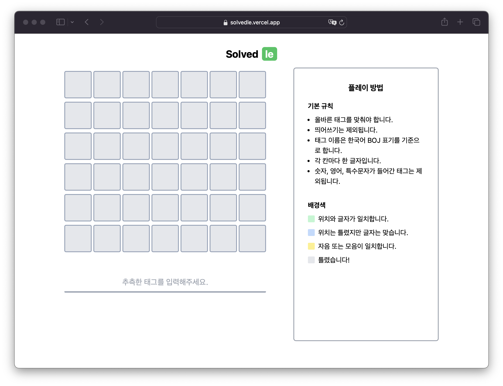

# Solvedle

솔브들(Solvedle)은 [**쌍근**](https://ssaangn.com/)에서 영감을 받아 제작한 솔브닥 태그 맞추기 게임입니다.

## How to Play
- 올바른 태그를 맞춰야 합니다.
- 띄어쓰기는 제외됩니다.
- 태그 이름은 한국어 표기를 기준으로 합니다.
- 간 칸마다 한 글자입니다.
- 숫자, 영어, 특수문자가 들어간 태그는 제외됩니다. `ex) 2-SAT, A*`
- 단) `-`의 경우는 없는 취급합니다. `ex) 벨만-포드 => 벨만포드`